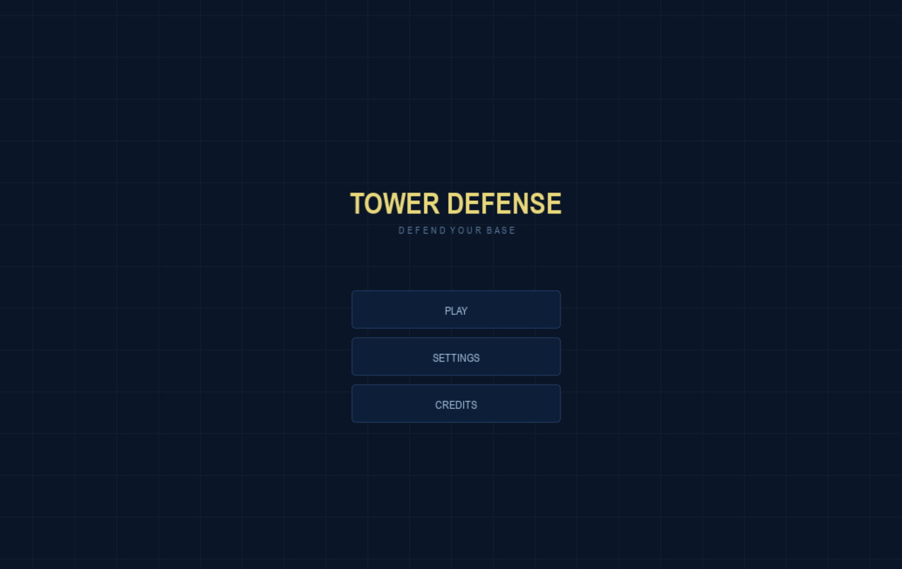
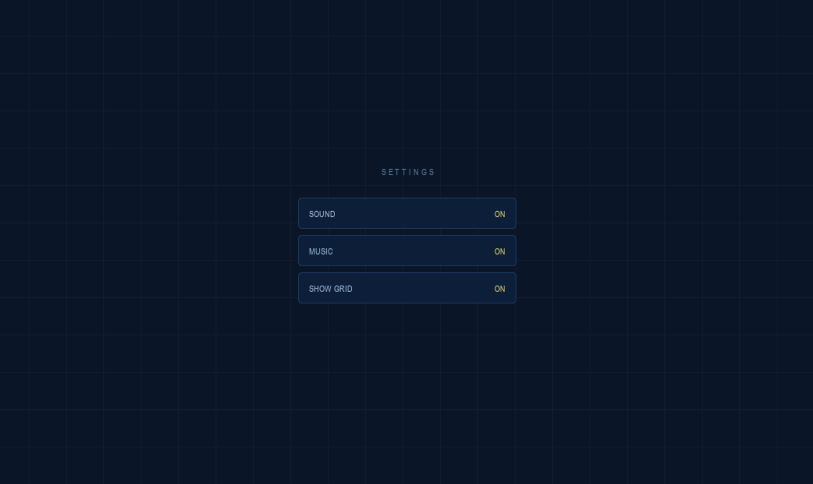
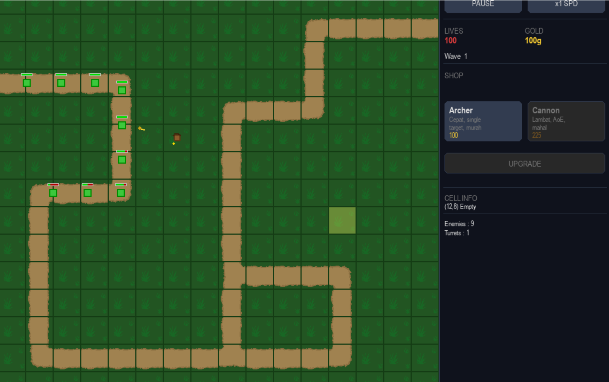
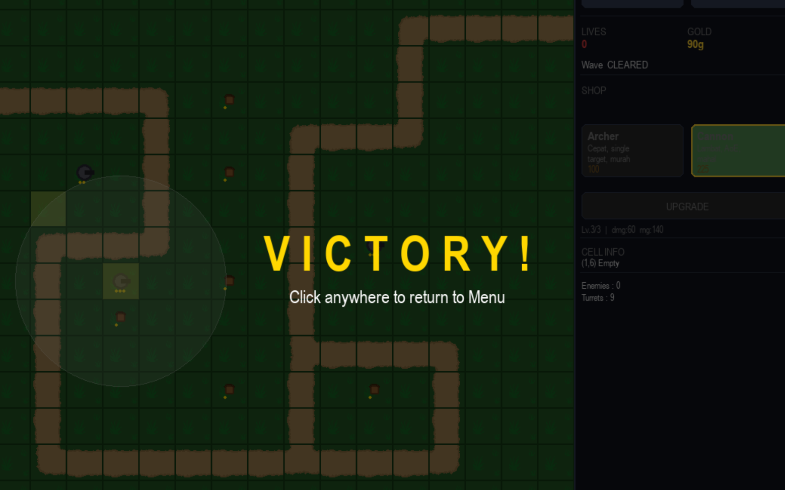
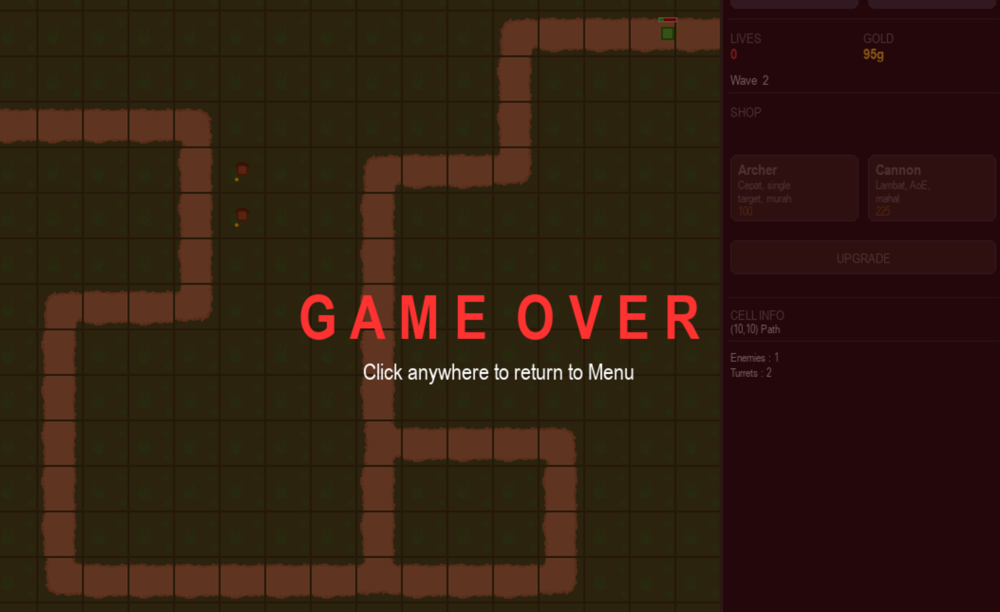

# TowerDefense

Game tower defense berbasis grid yang dibangun menggunakan **Python** dan **Pygame**, sebagai project mata kuliah **Pemrograman Berorientasi Objek (PBO)** Universitas Negeri Surabaya, 2026.

---

## Anggota Kelompok 8

| Nama | NIM |
|------|-----|
| Arya Wirya Putra Jatmiko | 046 |
| Mirza Fadhil Naufal | 049 |
| Galang Satria Permadi | 116 |
| Reynaldy Dwi Aryandito | 216 |

---

##  Deskripsi Project

Tower Defense adalah game berbasis grid 16×16 di mana pemain bertugas mempertahankan basis dari serangan gelombang (wave) musuh. Pemain menempatkan menara pertahanan (turret) di sel kosong untuk menghancurkan musuh sebelum mereka mencapai basis.

Pemain memulai dengan **100 nyawa** dan **200 gold**. Gold digunakan untuk membeli dan mengupgrade turret. Nyawa berkurang setiap musuh berhasil menembus pertahanan. Permainan dimenangkan jika semua **10 wave** berhasil diselesaikan.

---

##  Fitur Utama

-  **Peta grid 16×16** dengan jalur musuh berbasis sistem waypoint dan tile rendering bitmask
-  **3 jenis musuh:**
  - `NormalEnemy` — stats seimbang
  - `FastEnemy` — kecepatan tinggi, HP rendah
  - `TankEnemy` — HP sangat tinggi, lambat, damage besar ke basis
-  **2 jenis turret:**
  - `ArcherTower` — single-target, cepat, murah (100g)
  - `CannonTower` — area/splash damage, lambat, mahal (225g)
-  **Sistem upgrade turret** hingga level 3 (peningkatan damage, attack speed, dan range)
-  **10 wave musuh** dengan tingkat kesulitan yang semakin meningkat
-  **Kontrol kecepatan:** Pause, ×1, ×2, ×4
-  **HUD informatif:** statistik real-time, shop turret, info cell, info turret terpilih
-  **Main menu** lengkap dengan halaman Settings dan Credits
-  **Victory screen** setelah semua wave selesai
-  **Game Over screen** saat nyawa habis
-  **Sound effect & background music**

---

##  Cara Menjalankan

### Prasyarat

- Python 3.x ([download](https://www.python.org/downloads/))
- Library Pygame

### Langkah-langkah

```bash
# 1. Install Pygame
pip install pygame

# 2. Clone atau ekstrak project
git clone https://github.com/Mirrrrrrrrrrr/TowerDefense
cd TowerDefense

# 3. Jalankan game
python main.py
```

### Cara Bermain

| Aksi | Cara |
|------|------|
| Menempatkan turret | Pilih turret dari Shop → klik sel kosong di grid |
| Upgrade turret | Klik sel berisi turret → klik tombol **UPGRADE** |
| Pause / Resume | Klik tombol **PAUSE** di HUD |
| Ganti kecepatan | Klik tombol **SPD** untuk siklus ×1 / ×2 / ×4 |
| Kembali ke menu | Tekan **ESC** kapan saja |

---

##  Implementasi OOP

Project ini menerapkan empat pilar OOP secara menyeluruh:

### 1. Abstract Class & Abstract Method

Tiga abstract class utama didefinisikan menggunakan modul `abc`:

```python
# enemy.py
class Enemy(ABC):
    @abstractmethod
    def draw(self, surface: pygame.Surface): ...

# turret.py
class Turret(ABC):
    @abstractmethod
    def shoot(self, target) -> Projectile: ...
    @abstractmethod
    def draw(self, surface: pygame.Surface, hovered: bool = False): ...

class Projectile(ABC):
    @abstractmethod
    def on_hit(self, enemy, enemies: list): ...
    @abstractmethod
    def draw(self, surface: pygame.Surface): ...
```

### 2. Inheritance

Tiga hierarki pewarisan dalam project:

```
Enemy (ABC)
├── NormalEnemy
├── FastEnemy
└── TankEnemy

Turret (ABC)
├── ArcherTower
└── CannonTower

Projectile (ABC)
├── Arrow
└── Cannonball
```

Setiap subclass mewarisi atribut dan method dari parent-nya (`update()`, `take_damage()`, `find_target()`) dan mendefinisikan ulang nilai seperti `hp`, `speed`, `damage`, dan `cost` sesuai karakteristiknya.

### 3. Polymorphism

Diterapkan pada game loop di `main.py`. Semua enemy dipanggil dengan `enemy.draw(screen)` dalam satu loop yang sama, namun tiap subclass mengeksekusi implementasi yang berbeda:

- `NormalEnemy.draw()` → kotak hijau
- `FastEnemy.draw()` → lingkaran biru kecil
- `TankEnemy.draw()` → kotak merah besar

Hal yang sama berlaku untuk `turret.shoot()` (mengembalikan `Arrow` atau `Cannonball`) dan `projectile.on_hit()` (damage single-target vs. splash area).

### 4. Encapsulation

| Class | Atribut / Method | Akses | Keterangan |
|-------|-----------------|-------|------------|
| `Cell` (`map.py`) | `__occupied` | Private | Hanya dapat diakses via `is_occupied()` dan `occupy()` |
| `GameManager` (`game_manager.py`) | `__apply_upgrade()` | Private | Logika upgrade tidak dapat dipanggil langsung dari luar class |
| `gameSpeedCtrl` | `_speedIdx` | Protected | Diakses hanya melalui property `speed` dan method `cycle_speed()` |

---
# Screenshot
### 1. Main Menu


### 2. Settings


### 3. Credit


### 4. Gameplay


### 5. Victory


### 6. Game Over


---
##  Struktur File

```
TowerDefense/
├── main.py           # Entry point & game loop utama
├── game_manager.py   # GameManager (state global) & gameSpeedCtrl
├── map.py            # Class Cell & Grid (manajemen peta tile)
├── enemy.py          # Abstract Enemy + NormalEnemy, FastEnemy, TankEnemy
├── turret.py         # Abstract Turret & Projectile + ArcherTower, CannonTower, Arrow, Cannonball
├── hud.py            # HUD gameplay (shop, stats, upgrade)
├── main_menu.py      # MainMenu (Home, Settings, Credits)
├── wave_manager.py   # WaveManager (spawning & manajemen wave)
├── wave_data.py      # Konfigurasi 10 wave (SpawnEntry dataclass)
├── level_data.py     # Data statistik & biaya upgrade turret (LevelData dataclass)
├── assets.py         # Manajemen aset gambar & audio
└── assets/
    ├── img/          # Spritesheet tile
    └── sound/        # Sound effect & background music
```

---

##  Repository

[https://github.com/Mirrrrrrrrrrr/TowerDefense](https://github.com/Mirrrrrrrrrrr/TowerDefense)

---

*Dibuat untuk mata kuliah Pemrograman Berorientasi Objek — Dosen Pengampu: Rifqi Abdillah, S.Tr.T., M.Kom.*
